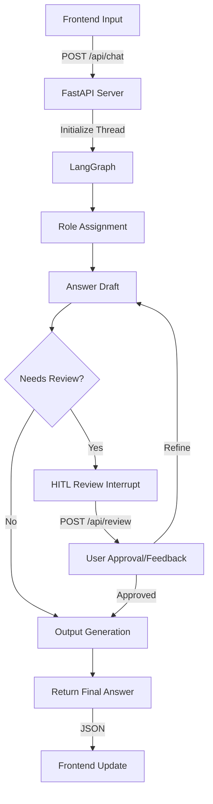

# MECON RAG Chatbot: Full End-to-End Workflow

This document provides a comprehensive breakdown of the data flow and operational logic for the MECON-AI RAG Chatbot, from the user's initial input to the final response and human-in-the-loop (HITL) review cycles.

---

## 1. Frontend: Initial Interaction (Input Phase)
The user interacts with the professional web interface to start a conversation.

| Step | Action | Description |
| :--- | :--- | :--- |
| **F1.0** | **Input Capture** | User types a query (e.g., "What are the specs for a blast furnace?") and selects a technical **Category**. |
| **F1.1** | **Query Submission** | `sendMessage()` in `static/app.js` is triggered. The UI adds the user's message and displays a **Typing Indicator**. |
| **F1.2** | **API Call** | A `POST /api/chat` request is sent with the query, category, and an unused `thread_id` (the server generates a fresh one per session). |

---

## 2. Backend: API Entry (Processing Start)
The FastAPI server (`server.py`) receives the request and initializes the graph.

| Step | Action | Description |
| :--- | :--- | :--- |
| **B2.0** | **Session Setup** | The server generates a unique `thread_id` (e.g., `th_7a8b...`) to track the conversation in memory. |
| **B2.1** | **Graph Invocation** | The `app_graph.stream()` method starts the **LangGraph** workflow with the `user_query` and `category`. |
| **B2.2** | **Node Execution** | The graph begins processing through its nodes (detailed in Section 3). |

---

## 3. Backend: LangGraph Execution (Core Logic)
The `workflow` in `graph/graph.py` manages the AI's reasoning and generation steps.

| Node | Name | Functionality |
| :--- | :--- | :--- |
| **N3.1** | `role_assignment` | Assigns an expert persona (e.g., "Steel Industry Expert") based on the query and category. |
| **N3.3** | `answer_draft` | Generates an initial technical draft using LLM knowledge (POC mode currently skips vector retrieval). |
| **N3.4** | `hitl_review` | **Interrupt Point.** The graph pauses here for human verification of the draft if `needs_human_review` is `true`. |
| **N3.5** | `output_generation` | Once the draft is approved, the agent formats the response into clean Markdown with technical headings and tables. |

---

## 4. Response Cycle: Human-in-the-Loop (HITL)
If the AI is unsure of its response, it requests expert feedback.

1.  **State check**: The server checks `is_waiting_for_review` by inspecting if the next node is `hitl_review`.
2.  **Frontend Notification**: The API returns the `current_draft` and `is_waiting_for_review: true`.
3.  **Review Card**: The frontend displays a **Review Card** with two actions:
    *   **✓ Approve & Format**: `submitReview('approve')` → State updated to `human_approved: True`. Graph resumes to `output_generation`.
    *   **↻ Refine Draft**: User adds feedback → `submitReview('refine', feedback)` → State updated to `human_approved: False` with feedback. Graph loops back to `answer_draft` for correction.

---

## 5. Metadata & UI Update (Response Phase)
The final stage where the user sees the AI-generated answer.

| Component | Responsibility | Updated By |
| :--- | :--- | :--- |
| **Main Chat** | Displays the final Markdown-rendered answer or the interactive review card. | `handleApiResponse()` |
| **Source Panel** | Showcases the retrieved document chunks (currently mock data in POC). | `updateSources()` |
| **Trace Panel** | Displays reasoning logs (e.g., "Retrieved specs", "Drafting answer", "HITL Review triggered"). | `updateTrace()` |
| **Thread ID** | Displays the current session ID in the top right for tracking. | `currentThreadId` variable |

---

## Summary Flow Diagram (Simplified)

